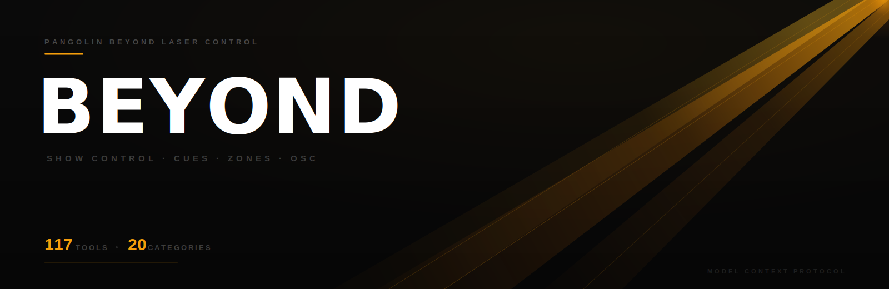

<p align="center">
  
</p>

# Beyond MCP

<p align="center">
  <a href="https://github.com/drohi-r/beyond-mcp/blob/main/LICENSE"></a>
  
  
  
  
</p>

An MCP server for [Pangolin BEYOND](https://pangolin.com/pages/beyond) laser software. Exposes 117 tools across 20 categories covering show control, cue management, zone configuration, geometric correction, live parameter control, effects, projector alignment, safety limiters, and more — all via OSC.

Built for live production. Pairs with [MA2 Agent](https://github.com/drohi-r/grandma2-mcp), [Resolume MCP](https://github.com/drohi-r/resolume-mcp), and [Companion MCP](https://github.com/drohi-r/companion-mcp) for full AI-driven show control.

## Why this exists

Pangolin BEYOND is the industry-standard laser show software, but programming laser cues, adjusting zones, and tuning live parameters is entirely manual. An operator clicks through the BEYOND UI, one parameter at a time, across dozens of zones and cues.

This MCP server lets an AI assistant control BEYOND over OSC. It can trigger cues, adjust master brightness, mute zones, set BPM, control projector alignment, apply geometric corrections, manage safety limiters, and control live parameters — all from a single conversation. Combined with MA2 Agent, Resolume MCP, and Companion MCP, an AI assistant can orchestrate the entire show control stack.

## Quick start

```bash
git clone https://github.com/drohi-r/beyond-mcp && cd beyond-mcp
uv sync
uv run python -m beyond_mcp
```

Make sure BEYOND is running with OSC input enabled (configurable via `BEYOND_OSC_PORT`, defaults to 12000).

For remote control:
- use LAN or WireGuard, not the public internet
- allow UDP to `BEYOND_OSC_PORT`
- set `BEYOND_HOST` to the remote machine and include it in `BEYOND_ALLOWED_HOSTS`

## Live-Validated Build Notes

This repo has been exercised against a real BEYOND instance over LAN, not only mocked unit tests.

Live-confirmed tools on the validated build:
- `display_popup`
- `set_bpm`
- `select_next_page` / `select_prev_page`
- `select_next_tab` / `select_prev_tab`
- `start_cue_by_name` / `stop_cue_by_name`
- `set_master_brightness`

Build-specific notes:
- `load_cue` sent cleanly but did not produce an obvious visible state change in the tested workspace.
- `display_preview("main", ...)` sent cleanly, but `main` did not appear to be the correct preview identifier for the validated BEYOND setup.

Full notes: [docs/live-validation.md](docs/live-validation.md)

## Configuration

| Variable | Default | Description |
|----------|---------|-------------|
| `BEYOND_HOST` | `127.0.0.1` | BEYOND instance IP |
| `BEYOND_OSC_PORT` | `12000` | OSC receive port |
| `BEYOND_ALLOWED_HOSTS` | `127.0.0.1,localhost,::1` | Comma-separated allowlist for target hosts. Set `*` to allow any. |
| `BEYOND_SAFETY_PROFILE` | `lab` | Safety preset: `lab`, `show-safe`, or `read-only` |
| `BEYOND_READ_ONLY` | `0` | Set to `1` for read-only mode (blocks all write operations) |
| `BEYOND_CONFIRM_DESTRUCTIVE` | `0` | Set to `1` to require `confirm=true` on destructive operations (blackout, stop_all, etc.) |
| `BEYOND_TRANSPORT` | `stdio` | MCP transport (`stdio`, `sse`, `streamable-http`) |

## Safety Profiles

`BEYOND_SAFETY_PROFILE` gives you a sane starting point without having to remember multiple flags:

- `lab`
  - `read_only = false`
  - `confirm_destructive = false`
- `show-safe`
  - `read_only = false`
  - `confirm_destructive = true`
- `read-only`
  - `read_only = true`
  - `confirm_destructive = true`

Explicit environment flags still win if you need to override the profile:

```bash
BEYOND_SAFETY_PROFILE=show-safe \
BEYOND_CONFIRM_DESTRUCTIVE=0 \
uv run python -m beyond_mcp
```

## Tools

### System

| Tool | What it does |
|------|-------------|
| `get_server_config` | Return current MCP server configuration and safety settings |
| `health_check` | Check if the BEYOND target is reachable and report resolved socket details |
| `send_osc_raw` | Send a raw OSC message for any address not wrapped by a named tool |
| `send_osc_bundle` | Send multiple OSC messages as an atomic bundle |
| `preview_osc` | Preview an OSC message without sending it (dry-run inspection) |
| `preview_osc_bundle` | Preview an OSC bundle without sending it |

### Master Controls

| Tool | What it does |
|------|-------------|
| `set_master_brightness` | Set master brightness (0-100) |
| `blackout` | Activate blackout — disable all laser output |
| `enable_laser_output` | Enable laser output (undo blackout) |
| `disable_laser_output` | Disable laser output |
| `master_pause` | Pause or unpause master playback |
| `master_pause_time` | Pause or unpause master playback with time sync |
| `set_master_speed` | Set master playback speed (0-10) |
| `stop_all_now` | Stop all playback immediately |
| `stop_all_sync` | Stop all playback with synchronization fade |
| `stop_all_async` | Stop all playback asynchronously with fade |

### BPM / Beat

| Tool | What it does |
|------|-------------|
| `set_bpm` | Set the BPM tempo value (1-999) |
| `set_bpm_delta` | Adjust BPM by a delta value |
| `beat_tap` | Register a beat tap for tempo detection |
| `beat_resync` | Resynchronize beat timing |
| `beat_source_timer` | Set beat source to internal timer |
| `beat_source_audio` | Set beat source to audio input |
| `beat_source_manual` | Set beat source to manual tap |

### Cue Mode

| Tool | What it does |
|------|-------------|
| `set_cue_mode_single` | Set cue mode to Single Cue (one active cue at a time) |
| `set_cue_mode_one_per` | Set cue mode to One Per (one per group) |
| `set_cue_mode_multi` | Set cue mode to Multi Cue (multiple simultaneous cues) |

### Click Behavior

| Tool | What it does |
|------|-------------|
| `click_mode_select` | Set click behavior to Select mode |
| `click_mode_toggle` | Set click behavior to Toggle mode |
| `click_mode_restart` | Set click behavior to Restart mode |
| `click_mode_flash` | Set click behavior to Flash mode |
| `click_mode_solo_flash` | Set click behavior to Solo Flash mode |
| `click_mode_live` | Set click behavior to Live mode |
| `set_click_scroll` | Set a click-scroll parameter (zoom, size, fade, vpoints, scanrate, color, anispeed, red, green, blue, alpha) |

### Transitions

| Tool | What it does |
|------|-------------|
| `set_transition_type` | Set the transition type by index |
| `set_master_transition_index` | Set the master transition effect index |
| `set_master_transition_time` | Set the master transition time in seconds |

### Cue / Cell Control

| Tool | What it does |
|------|-------------|
| `select_cue` | Select a cue by name |
| `start_cue_by_name` | Start a cue by name |
| `stop_cue_by_name` | Stop a cue by name |
| `stop_cue_now` | Stop a specific cue immediately |
| `stop_cue_sync` | Stop a specific cue with synchronization fade |
| `cue_down` | Navigate cue selection downward |
| `cue_up` | Navigate cue selection upward |
| `pause_cue` | Pause or unpause a cue |
| `restart_cue` | Restart a cue from the beginning |
| `focus_cell` | Focus on a cell by page and cue coordinates |
| `focus_cell_index` | Focus on a cell by linear index |
| `start_cell` | Start the currently focused cell |
| `restart_cell` | Restart the currently focused cell |
| `stop_cell` | Stop the currently focused cell |
| `shift_focus` | Shift cell focus by direction offset |
| `move_focus` | Move cell focus by delta X and Y |
| `unselect_all_cues` | Deselect all active cues |

### Workspace

| Tool | What it does |
|------|-------------|
| `load_cue` | Load a cue by name without starting it |
| `load_workspace` | Load a workspace by name |

### Page / Tab / Category Navigation

| Tool | What it does |
|------|-------------|
| `select_page` | Select a page by index |
| `select_next_page` | Navigate to the next page |
| `select_prev_page` | Navigate to the previous page |
| `select_tab` | Select a tab by index |
| `select_tab_by_name` | Select a tab by name |
| `select_next_tab` | Navigate to the next tab |
| `select_prev_tab` | Navigate to the previous tab |
| `select_all_categories` | Select all content categories |
| `select_category` | Select a content category by index |
| `select_category_by_name` | Select a content category by name |
| `select_next_category` | Navigate to the next content category |
| `select_prev_category` | Navigate to the previous content category |

### Grid Management

| Tool | What it does |
|------|-------------|
| `set_grid_size` | Set the cue grid dimensions |
| `select_grid` | Select a grid by index |

### Zone Control

| Tool | What it does |
|------|-------------|
| `mute_zone` | Mute a projection zone by index |
| `unmute_zone` | Unmute a projection zone by index |
| `toggle_mute_zone` | Toggle mute state for a projection zone |
| `unmute_all_zones` | Unmute all projection zones |
| `stop_zone` | Stop output on a zone with optional fade time |
| `stop_zone_by_name` | Stop output on a zone by name |
| `stop_zones_of_projector` | Stop all zones assigned to a projector |
| `stop_projector_by_name` | Stop all zones of a projector by name |
| `select_zone` | Select a projection zone |
| `select_zone_by_name` | Select a projection zone by name |
| `unselect_zone` | Unselect a projection zone |
| `unselect_all_zones` | Unselect all projection zones |
| `toggle_select_zone` | Toggle selection state for a projection zone |
| `store_zone_selection` | Store the current zone selection for later recall |
| `restore_zone_selection` | Restore a previously stored zone selection |
| `set_zone_brightness` | Set brightness for a specific zone (0-100) |

### Live Control Parameters (Master scope)

| Tool | What it does |
|------|-------------|
| `set_master_size` | Set master size X and Y (-400 to 400) |
| `set_master_position` | Set master position X and Y (-32768 to 32768) |
| `set_master_rotation` | Set master rotation angles X, Y, Z (-2880 to 2880) |
| `set_master_rotation_speed` | Set master continuous rotation speed X, Y, Z (-1440 to 1440) |
| `set_master_color` | Set master color RGB (0-255 each) |
| `set_master_alpha` | Set master alpha/opacity (0-255) |
| `set_master_zoom` | Set master zoom (0-100) |
| `set_master_scan_rate` | Set master scan rate (10-200) |
| `set_master_visible_points` | Set master visible points percentage (0-100) |
| `set_master_color_slider` | Set master color slider (0-255) |
| `set_master_animation_speed` | Set master animation speed (0-400) |

### Live Control: Effects (Master scope)

| Tool | What it does |
|------|-------------|
| `set_master_effect` | Set an effect on a master FX slot (slot 1-4, effect_index -1..47) |
| `set_master_effect_action` | Set the action/intensity of a master FX slot (slot 1-4, value 0-100) |

### Projector Control

| Tool | What it does |
|------|-------------|
| `set_projector_size` | Set projector output size X and Y (-100 to 100) |
| `set_projector_position` | Set projector output position X and Y (-100 to 100) |
| `projector_swap_xy` | Toggle projector X/Y axis swap |
| `projector_invert_x` | Toggle projector X-axis inversion |
| `projector_invert_y` | Toggle projector Y-axis inversion |

### Zone Setup / Geometric Correction

| Tool | What it does |
|------|-------------|
| `zone_setup_select` | Select a zone for geometric setup |
| `zone_setup_next_zone` | Navigate to the next zone in setup |
| `zone_setup_prev_zone` | Navigate to the previous zone in setup |
| `zone_setup_select_param` | Select a geometric parameter by index for editing |
| `zone_setup_next_param` | Navigate to the next geometric parameter |
| `zone_setup_prev_param` | Navigate to the previous geometric parameter |
| `zone_setup_set` | Set a zone geometric correction parameter (xsize, ysize, xposition, yposition, zrotation, keystone, pincussion, bow, shear, and more) |

### Safety Limiter

| Tool | What it does |
|------|-------------|
| `set_limiter` | Set a safety limiter (profile, per_zone, per_grid, flash, hold, beam, dmx, show) |

### Display

| Tool | What it does |
|------|-------------|
| `display_popup` | Display a popup message in BEYOND |
| `display_preview` | Show or hide a named preview window |

### DMX / Channel Output

| Tool | What it does |
|------|-------------|
| `channel_out` | Send a value to a BEYOND output channel |

### Control Scope

| Tool | What it does |
|------|-------------|
| `set_control_scope` | Set the live control target scope (master, cue, zone, track, projector, smart) |

### Virtual LJ

| Tool | What it does |
|------|-------------|
| `virtual_lj` | Enable or disable Virtual LJ mode |
| `virtual_lj_fx` | Trigger a Virtual LJ effect |

## Claude Desktop

```json
{
  "mcpServers": {
    "beyond": {
      "command": "uv",
      "args": ["run", "--directory", "/path/to/beyond-mcp", "python", "-m", "beyond_mcp"],
      "env": {
        "BEYOND_HOST": "127.0.0.1",
        "BEYOND_OSC_PORT": "12000"
      }
    }
  }
}
```

## VS Code / Cursor

```json
{
  "servers": {
    "beyond": {
      "command": "uv",
      "args": ["run", "--directory", "/path/to/beyond-mcp", "python", "-m", "beyond_mcp"],
      "env": {
        "BEYOND_HOST": "127.0.0.1",
        "BEYOND_OSC_PORT": "12000"
      }
    }
  }
}
```

## Production safety

This server is designed for live show environments where accidental commands can disrupt a running laser show. All 117 tools include full parameter validation.

- **UDP fire-and-forget** -- BEYOND OSC control uses UDP, meaning commands are sent without acknowledgement. There is no rollback. Every tool call is a real action on the laser system.
- **Host allowlisting** -- only `127.0.0.1`, `localhost`, and `::1` are permitted by default. Add LAN hosts explicitly via `BEYOND_ALLOWED_HOSTS`. Set `*` to allow any host.
- **Read-only mode** -- set `BEYOND_READ_ONLY=1` to block all write operations. Only `get_server_config`, `health_check`, `preview_osc`, and `preview_osc_bundle` remain available.
- **Confirm-destructive gating** -- set `BEYOND_CONFIRM_DESTRUCTIVE=1` to require `confirm=true` on destructive operations, including raw/bundle sends of destructive OSC addresses and disruptive named tools like `load_workspace`, `stop_zone`, and `stop_projector_by_name`.
- **Health check** -- `health_check` verifies BEYOND target reachability via DNS resolution and UDP socket test and reports the resolved address family/socket target.
- **OSC bundle support** -- `send_osc_bundle` sends multiple OSC messages as an atomic bundle, ensuring all-or-nothing delivery for coordinated multi-parameter changes.
- **Preview before send** -- `preview_osc` and `preview_osc_bundle` return the exact packet details without transmitting anything. Use them before high-risk live operations.
- **Input validation** -- all 117 tools with documented parameter ranges enforce bounds before any OSC message is built. Brightness, zoom, scan rate, size, position, rotation, color, BPM, speed, fade times, effect slots, limiter types, geometric correction parameters, and non-negative indexes are all range-checked. Invalid inputs return structured JSON errors, never raw exceptions.
- **Error isolation** -- all tools are wrapped in `_handle_errors`. OSC send failures, JSON parse errors, validation failures, and unexpected exceptions return `{"ok": false, "error": "...", "blocked": true}` instead of crashing the MCP session.
- **Transport validation** -- only `stdio`, `sse`, and `streamable-http` transports are accepted. Invalid transport values raise immediately at startup.
- **Port validation** -- `BEYOND_OSC_PORT` is validated as an integer in the 1-65535 range at config load time.
- **Raw escape hatch** -- `send_osc_raw` allows any OSC address for coverage beyond the named tools, but requires explicit JSON array input and validates structure before sending.

## Development

```bash
uv sync
uv run python -m pytest -v
```

## License

[Apache 2.0](LICENSE)
